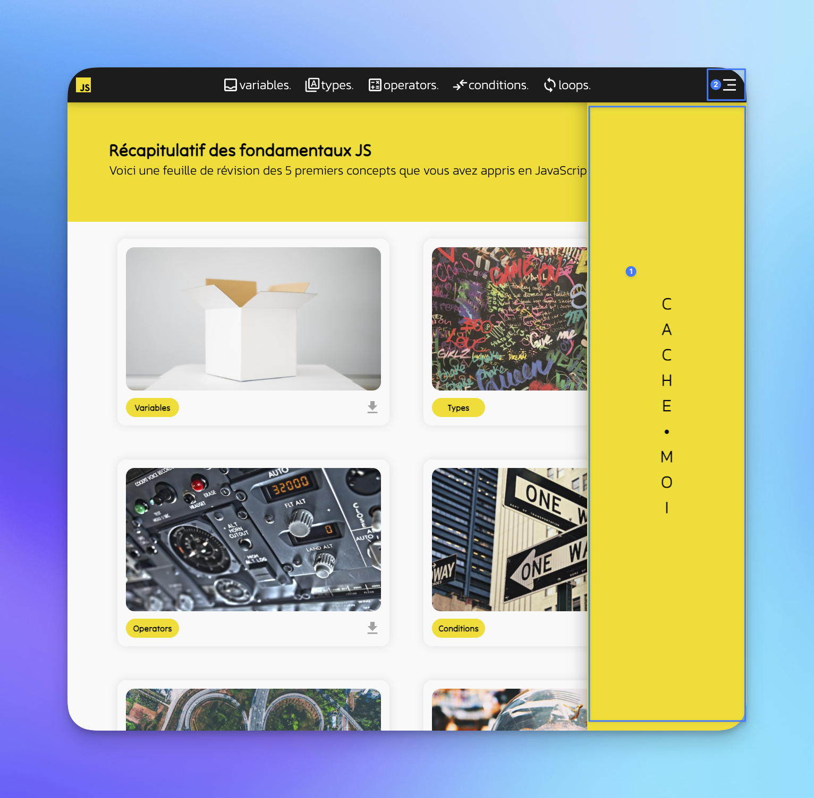

# AgiliExercise n°1
Pour mes étudiant(e)s

---

 

Les instructions pour la réalisation de ce TP sont simples :

1. Clonez ce dépôt dans votre répertoire de travail et ouvrez-le dans votre éditeur de code préféré.
2. L'interface est déjà prête, cependant, il faut encore ajouter les fonctionnalités. Pour cela, vous devez modifier le fichier `main.js` et le fichier `main.css`.

## Les résultats attendus sont les suivants :

Faire apparaître et disparaître la barre latérale (1) en cliquant sur l'icône (2) de la navigation en haut à droite.

## Comment rendre ta réalisation ?

1. Publie ton code dans un dépôt Github public et envoie-moi le lien du TP.
2. Déploie également le projet sur GitHub Pages

## Conseils

**Rédige ton algorithme**, fais des recherches sur le web, parcours mes dépôts GitHub et surtout lis la documentation MDN.

Bon TP !
